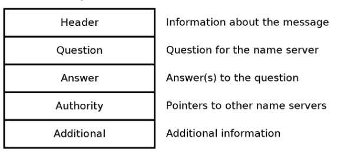
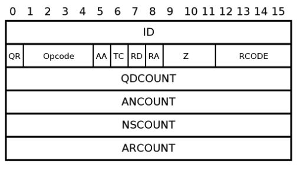
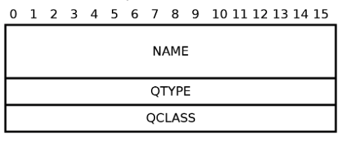
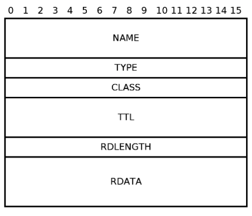

# DNS Query

Domain Name Servie (DNS) resolves a domain names of a reources into the numerical IP addresses. IP address is used by underlying network protocols to route the message to the resource

For example, domain name google.com is resolved to IP `172.217.169.46`.

protocol: **UDP**
port: **53**

DNS query is not encrypted and easily to decode. Following hex dump demonstrates a DNS message. This message is further wrapped into datagram and etherenet frame. Only then it is sent to DNS server.

```
0000  e4 88 81 80 00 01 00 01  00 00 00 00 06 67 6f 6f   ........ .....goo
0010  67 6c 65 03 63 6f 6d 00  00 1c 00 01 c0 0c 00 1c   gle.com. ........
0020  00 01 00 00 00 01 00 10  2a 00 14 50 40 09 08 1b   ........ *..P@...
0030  00 00 00 00 00 00 20 0e                            ...... . 

```

At first above message seems cryptic and does not make much sense. Thats why further section explains the meaning of the bytes that form the message.

## DNS Message Format

Byte array from above section can contains following fields:



This message is the same for client request and server response. In case of the client, following fields are left empty:

- Answer
- Authority
- Additional

### Header
Header describes the message and has 12 bytes.



**ID (16-bit)**
Arbitrary value set by client used as a message identifier. Client uses the ID to identify the answer if sent multiple queries at the same time.

**QR (1-bit)**
Indicates whether the message is DN query or response

- 0 - query
- 1 - response

**opcode (4-bit)**
Defines type of query:

- 0 - standard query
- 1 - reverse query to reverse an IP address int a name
- 3-15 - reserved values

**AA (1-bit)**
The answer is authoritative when set.

**TC (1-bit)**
Message is truncated when set. It should be requested again via TCP.

**RD (1-bit)**
Should be set when recursion is desired. It can indicate that DNS server should contact addtional servers to complete answer.

**RA (1-bit)**
Server supports recursion when set.

**Z (1-bit)**
Unused and should be set to 0.

**RCODE (4-bit)**
Indicates error in condition:

- 0 - success
- 1 - format error
- 2 - server faulure
- 3 - name error
- 4 - not implemented
- 5 - refused

**QDCOUNT**, **ANCOUNT**, **NSCOUNT** and **ARCOUNT**
Indicates number of records in corresponding answer

### Question
Question contains the name for which we want to resolve the address.



**NAME (2-bit)**
DNS name that needs to be resolved. It is using special encoding. DNS name google.com should be broken into labels:

- www
- example
- com
- 1 byte indicating length
- 0 - to define the end

**QTYPE (16-bit)** 
Requested record type.

**QCLASS (16-bit)**
Should be set to 1 to be used for the internet.

### Answer
DNS server respond to the question with answer. It contains the corresponding IP address for DNS name in RDATA field



**Name**, **Type**, **CLASS** 
Thes fields are repeated from the question. Values might not be defined explicitly but contain a pointer to the actual value in the quest

**TTL**
The lenght how long the query should be cached.

## Conclusion
DNS makes internet approachable for people. It makes easy to remember names of our favourite websites and in the same way provides a reliable system for defining their address. This post described the data exchanged between client and server resolving the domain names. However, the topic itself is much broader and still evolving. One of the recent changes was introducing DNS over HTTPS which moves internet towards more secure and private space.

To learn more you can read following links:

- RFC DNS: [https://tools.ietf.org/html/rfc1035](https://tools.ietf.org/html/rfc1035)
- DNS Queries over HTTPS: [tools.ietf.org/html/rfc8484](https://tools.ietf.org/html/rfc8484)
- Cloudflare DNS over HTTPS: [developers.cloudflare.com/1.1.1.1/dns-over-https](https://developers.cloudflare.com/1.1.1.1/dns-over-https/)